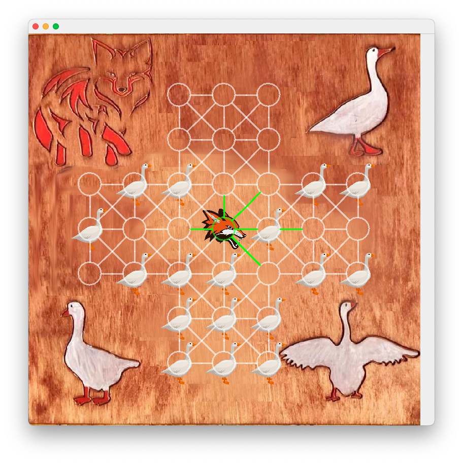
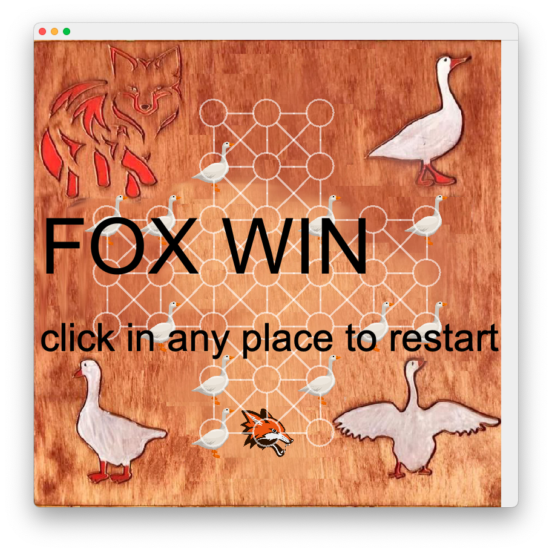
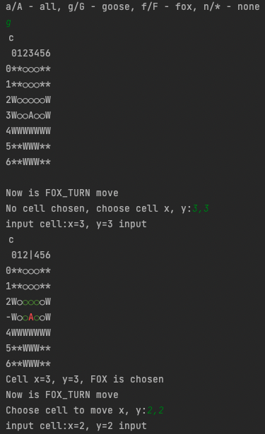

# Fox and Geese game
## Old asymmetric board games for two players
### Rules
1) The fox is placed in the middle of the board, and 17 geese are placed on one 
side of the board.
2) The fox and geese can move to any empty space around them (also diagonally).
3) The fox can jump over geese like in checkers, capturing them. Repeated jumps are possible.
4) Capturing is not mandatory
5) Geese can not jump.
### Win conditions
#### Fox wins when:
1) Less than 3 geese left, and they can't capture fox physically
2) Fox reach bottom of game board   
#### Geese win when:
1) fox has no move(geese surround the fox so that it cannot move)

## Game support graphic interface as well as console(terminal) mode
### Graphic

### Console
